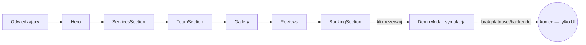

# ARCHITECTURE — mapa dla obcego (1 strona)

<!-- Cel: senior, ktory nigdy nie widzial repo, znajduje miejsce zmiany w 15 min. -->

## Co to jest (3 zdania)
Demo site "Nordik Salon" — **fikcyjny** premium salon fryzjerski w Reykjavíku, zbudowany jako
pokazowy przykład dla klientów agencji [Reykjawwwik](https://reykjawwwik.is). Design: nordycki
minimalizm, jasny cennik usług, rezerwacja jako jedyna oczywista akcja widoczna z każdej pozycji
scrolla. Zero prawdziwych klientów/rezerwacji/płatności — to wizytówka sprzedażowa dla branży
beauty/hair, nie działający system.

## Stack (z package.json / README)
- Frontend: React + TypeScript, Vite, react-router-dom (1 realna trasa), TanStack Query (bez realnych zapytań)
- UI: Tailwind CSS + shadcn/ui (Radix), lucide-react
- Backend/DB: **brak** — demo nie ma nic do trwałego zapisu
- i18n: `src/i18n/translations.tsx` (`I18nProvider`, w jednym pliku razem ze słownikiem)
- Testy: Playwright E2E + Vitest (`src/test/`)
- Hosting: **Lovable** (`lovable-tagger` w `vite.config.ts`) — `git push` na `main` NIE deployuje,
  produkcję aktualizuje ręczny **Publish** w Lovable UI

## Moduły i granice (co jest gdzie)
| Katalog / plik | Odpowiedzialność | Tier |
|---|---|---|
| `src/pages/Index.tsx` | jedyna realna strona — składa sekcje one-page | T1 |
| `src/components/ServicesSection.tsx` | cennik usług (cięcie/koloryzacja/stylizacja) | T1 |
| `src/components/BookingSection.tsx` | CTA rezerwacji — kończy się modalem demo, bez realnej integracji | T1 |
| `src/components/DemoModal.tsx` | `DemoModalProvider` — rdzeń mechaniki: podmienia realne akcje na komunikat informacyjny | T1 |
| `src/components/TeamSection.tsx` | profile stylistów | T1 |
| `src/components/BeforeAfterSection.tsx` / `GallerySection.tsx` | galeria wizualna — kluczowa dla branży sprzedającej "na oko" | T1 |
| `src/components/GiftCardSection.tsx` | karty podarunkowe (prezentacja oferty, bez realnej płatności) | T1 |
| `src/components/InstagramSection.tsx` | sekcja social-proof (statyczne miniatury) | T0 |
| `src/i18n/translations.tsx` | słownik + provider języka (jeden plik) | T1 |

## Przepływ użytkownika

## Gdzie jest…
- cennik usług: `src/components/ServicesSection.tsx`
- teksty PL/EN/IS: `src/i18n/translations.tsx`
- symulacja rezerwacji: `src/components/DemoModal.tsx`, wywoływane z `BookingSection.tsx` / `FloatingContact.tsx`
- sekrety: brak (zero integracji zewnętrznych)

## Decyzje nieodwracalne
`docs/adr/` — zobacz istniejące ADR w repo.

## Jak to cofnąć / kill switch
Strona statyczna bez backendu — rollback = Lovable "Revert to this version" albo `git revert` + Publish.
